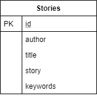

# SFIA2-Project

## Story scenario generator with microservice arcitecture

### Table of contents

1. Introduction
1. Breif
1. Soloution
1. Trello board
1. Database
1. Risk Assessment
1. Issues
1. Testing
1. Deployment
1. Improvements for the future

### Introduction
The focus of this project was to make a core dev ops pipeline and design an application with a microservice arcitecture. 

### Brief 
Create a functional website following best practices. The website had to be comprised of four microservices that functioned and could be deployed inderpendently and must persist some data into a database. It must be fully intergrated with a vcs (git), have clear documentation and follow agile principles. This includes a project tracking board identifing user stories, tasks and progression. 

### soloution 
I decided to create a website that would generate three random words. A setting word was randomly generated by service 2, a noun was generated by service 3 and service 4 returned the outputs of service 2 and 3, formated them and added a tempo. Users could then create a story given the random scenario and share the story. The app used Nginx to allow access from only port 80. The develpoment also features a jenkins pipeline which is activated by a webhook. It builds images and pushes them to docker hub and uses ansible to setup the correct enviroment on additional VM's for a swarm deployment aswell as adds workers. Finally jenkins deploys the services as a stack using docker compose and each container is replicated allowing a rolling deployment.

### Trello board

### Database

The database used allowed users to share the stories the created. It also stored the words the were given to create the story.

### Risk Assessment
Risk Assessment

### Issues

### Testing
Testing for this project could be massively improved. Mocking http request would allow me to test my homepage functionality (creating posts and rcieving http requests). Adding intergration testing would make the testing more comprehensive. Finally the testing infrastructed should be incorpated into the jenkins pipeline.

### Deployment

Intital testing for the rolling deployment utilised a webhook between github and docker however, each image was queued for over 10 mins on average. Therfore it was decided it was too slow to showcase rolling deployment. Instead the images were built locally by jenkins and pushed to docker hub. Also if I had more time I would incorparate a testing stage and suite into the pipeline creating a pipeline that more closely represents industry standards. Finally I would incorparate intergration testing with selenium.

### Improvements for the future
Due to this being an individual project and the app being very basic I didnt prioritise testing as much as I should of. So the biggest improvement I could make would be to add comprehensive testing with intergration testing. Which would be incorparated into the jenkins pipeline following a test driven development approach.

If I were to develop this app further I would like to:
1. Add mocking functionality to increase unit testing coverage.
1. Add intergration testing.
1. Add a testing stage to the jenkins pipeline.
1. Implement the users model with the ERD shown above. This would include login and restricted access.
1. Implement an upvoting system to reward some of the best stories.

### Authors
#### By Tom Petty
